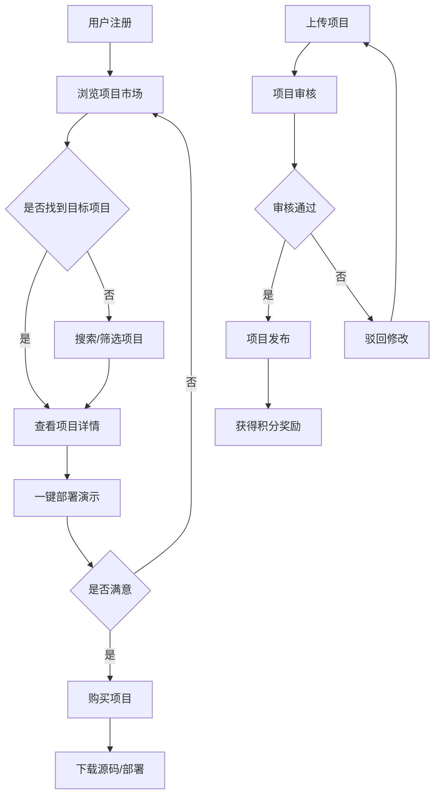

# 速码网需求分析报告

## 1. 项目概述

### 1.1 项目背景
速码网是一个综合性的源码交易平台，旨在解决当前源码交易市场缺乏标准化部署和验证机制的问题。平台通过Docker化标准、一键部署、积分经济等创新功能，为开发者提供高质量的源码交易和部署服务。

### 1.2 项目目标
- **提升交易效率**：通过标准化流程减少交易摩擦
- **降低部署门槛**：提供一键部署和演示功能
- **保证代码质量**：建立人工审核机制
- **创造价值闭环**：通过积分系统激励优质内容

### 1.3 成功标准
- 用户注册转化率 > 15%
- 项目部署成功率 > 95%
- 用户满意度评分 > 4.5/5.0
- 平台月活跃用户数持续增长

## 2. 需求分析

### 2.1 功能需求

#### 2.1.1 用户故事列表

**作为注册用户，我希望能够：**
- US-001: 通过邮箱注册账户，以便开始使用平台服务
- US-002: 浏览项目市场，以便找到需要的源码项目
- US-003: 搜索和筛选项目，以便快速定位目标项目
- US-004: 查看项目详情和演示，以便评估项目质量
- US-005: 购买项目并下载源码，以便在自己的环境中使用
- US-006: 上传自己的项目，以便通过销售获得积分收益
- US-007: 管理我的项目（购买的、上传的、收藏的），以便统一管理
- US-008: 使用一键部署功能，以便快速验证项目效果
- US-009: 管理积分账户，以便进行充值、消费和提现
- US-010: 接收消息通知，以便及时了解重要事件

**作为管理员，我希望能够：**
- US-011: 管理用户账户，以便维护平台秩序
- US-012: 审核项目内容，以便保证平台质量
- US-013: 管理财务数据，以便监控平台运营状况
- US-014: 配置系统参数，以便优化平台运行
- US-015: 监控系统状态，以便及时发现和解决问题

#### 2.1.2 功能模块清单

**用户端功能模块：**
1. **用户管理系统** (6个功能需求)
2. **项目市场功能** (13个功能需求)
3. **项目管理** (15个功能需求)
4. **一键部署服务** (9个功能需求)
5. **支付与交易系统** (6个功能需求)
6. **积分经济系统** (10个功能需求)
7. **用户交互功能** (5个功能需求)

**管理后台功能模块：**
8. **管理后台功能** (13个功能需求)
9. **安全与合规** (8个功能需求)
10. **性能与监控** (9个功能需求)

#### 2.1.3 业务流程图

**核心业务流程：**

### 2.2 非功能需求

#### 2.2.1 性能要求
- **响应时间**：页面加载时间 < 3秒
- **并发用户**：支持1000+并发用户
- **系统可用性**：99.5%以上
- **数据库性能**：查询响应时间 < 500ms

#### 2.2.2 安全要求
- **身份认证**：支持JWT Token认证，有效期24小时
- **数据加密**：敏感数据AES-256加密存储
- **传输安全**：HTTPS/TLS 1.3加密传输
- **访问控制**：API访问频率限制（100次/分钟）

#### 2.2.3 可用性要求
- **界面设计**：符合Material Design规范
- **响应式设计**：支持桌面端和移动端
- **用户体验**：核心功能操作不超过3次点击
- **错误处理**：提供清晰的错误信息和解决建议

#### 2.2.4 兼容性要求
- **浏览器兼容**：Chrome 90+, Firefox 88+, Safari 14+
- **设备兼容**：桌面端、平板、手机
- **系统集成**：支持Docker容器化部署

## 3. 技术约束

### 3.1 技术栈限制
- **前端框架**：Vue 3 + Composition API
- **后端框架**：Spring Boot 3
- **数据库**：MySQL 8.0
- **开发环境**：VSCode容器开发
- **部署方式**：容器化部署

### 3.2 集成要求
- **双前端架构**：用户端和管理后台分离
- **API设计**：RESTful API + GraphQL（可选）
- **文件存储**：支持本地存储和云存储
- **消息队列**：RabbitMQ或Redis

### 3.3 部署环境
- **开发环境**：Docker容器化开发
- **测试环境**：Kubernetes集群
- **生产环境**：云原生部署
- **监控系统**：Prometheus + Grafana

## 4. 风险评估

### 4.1 技术风险
- **容器安全风险**：Docker容器可能存在安全漏洞
  - **影响程度**：高
  - **发生概率**：中
  - **缓解措施**：使用安全扫描工具，定期更新基础镜像

- **双前端复杂性**：两个前端应用的维护和部署复杂度
  - **影响程度**：中
  - **发生概率**：高
  - **缓解措施**：建立共享组件库，统一构建和部署流程

### 4.2 业务风险
- **代码质量控制**：上传的项目质量参差不齐
  - **影响程度**：高
  - **发生概率**：中
  - **缓解措施**：建立严格的审核流程和自动化检测

- **用户接受度**：用户对新平台的接受程度不确定
  - **影响程度**：中
  - **发生概率**：中
  - **缓解措施**：提供详细的使用指南和客服支持

### 4.3 缓解措施
1. **技术风险缓解**：
   - 建立完善的测试体系
   - 实施代码审查制度
   - 使用自动化安全扫描工具

2. **业务风险缓解**：
   - 建立用户反馈机制
   - 提供详细的产品文档
   - 实施分阶段发布策略

## 5. 建议方案

### 5.1 推荐技术栈
基于项目需求和技术约束，推荐以下技术栈：

**前端技术栈：**
- Vue 3 + TypeScript + Vite
- Pinia状态管理
- Element Plus UI组件库
- Vue Router 4路由管理

**后端技术栈：**
- Spring Boot 3 + Spring Security 6
- Spring Data JPA + MyBatis Plus
- Redis缓存 + RabbitMQ消息队列
- Swagger 3 API文档

**基础设施：**
- MySQL 8.0主数据库
- Redis 7.0缓存和会话存储
- MinIO对象存储
- Docker + Kubernetes容器化部署

### 5.2 架构建议
1. **采用微服务架构**：便于扩展和维护
2. **实施双前端分离**：用户端和管理端独立开发部署
3. **建立共享组件库**：提高开发效率和一致性
4. **使用API网关**：统一API管理和安全控制

### 5.3 实施建议
1. **分阶段开发**：按照MVP原则，优先实现核心功能
2. **持续集成部署**：建立CI/CD流水线，提高开发效率
3. **完善测试体系**：单元测试、集成测试、端到端测试
4. **建立监控体系**：实时监控系统状态和用户行为

---

*本需求分析报告基于当前业务需求和技术约束制定，将根据项目进展和用户反馈持续更新。*
